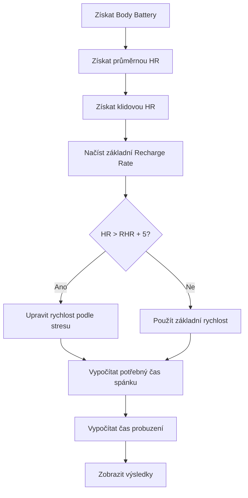

# Výpočet parametru "Recharge Rate" v PeakSleep

## Přehled

Parametr **Recharge Rate** (rychlost regenerace) je klíčový ukazatel, který určuje, jak rychle se vaše Body Battery doplňuje během spánku. Tento parametr přímo ovlivňuje výpočet doporučeného času spánku a času, kdy byste měli jít spát.

## 1. Základní Recharge Rate (Base Recharge Rate)

### Zdroj hodnoty
- **Výchozí hodnota:** 11.0 bodů Body Battery za hodinu
- **Uživatelské nastavení:** Lze změnit v nastavení aplikace
- **Rozsah nastavení:** 1-30 bodů za hodinu
- **Výchozí hodnota v nastavení:** 10 bodů/hod

### Implementace
```monkey-c
function getBaseRechargeRate() as Float {
    var rate = Application.Properties.getValue(BASE_RECHARGE_RATE_KEY); 
    if (rate instanceof Number) {
        return rate.toFloat();
    }
    if (rate instanceof Float) {
        return rate;
    }
    return DEFAULT_RECHARGE_RATE; // 11.0f
}
```

## 2. Úprava podle stresového stavu

### Algoritmus úpravy
Aplikace dynamicky upravuje základní rychlost regenerace na základě aktuálního stresového stavu organismu:

```monkey-c
function calculateAdjustedRechargeRate(baseRate as Float, hr as Number?, rhr as Number?) as Float {
    if (hr != null && rhr != null && hr > rhr + 5) { 
        var stressFactor = hr - rhr - 5;
        var adjusted = baseRate * (1.0 - (stressFactor * 0.01));
        var minRate = baseRate * 0.5;
        return adjusted > minRate ? adjusted : minRate;
    } 
    return baseRate;
}
```

### Podmínky úpravy
1. **Aktivace:** Pouze pokud je aktuální srdeční frekvence (HR) o více než 5 tepů vyšší než klidová (RHR)
2. **Stresový faktor:** `stressFactor = currentHR - restingHR - 5`
3. **Úprava rychlosti:** `adjustedRate = baseRate × (1.0 - (stressFactor × 0.01))`
4. **Minimální hranice:** Rychlost nemůže klesnout pod 50% základní hodnoty

### Příklad výpočtu úpravy
**Vstupní data:**
- Základní Recharge Rate: 11 bodů/hod
- Klidová srdeční frekvence (RHR): 60 tepů/min
- Aktuální srdeční frekvence (HR): 75 tepů/min

**Výpočet:**
1. Stresový faktor: 75 - 60 - 5 = 10
2. Upravená rychlost: 11 × (1.0 - (10 × 0.01)) = 11 × 0.9 = **9.9 bodů/hod**

## 3. Získávání vstupních dat

### Body Battery (aktuální úroveň)
- **Primární zdroj:** `SensorHistory.getBodyBatteryHistory()`
- **Záložní zdroj:** `UserProfile.getBodyBatteryHistory()`
- **Poslední možnost:** `UserProfile.getBodyBattery()`

### Průměrná srdeční frekvence (HR)
- **Období:** Průměr za posledních 2 hodiny
- **Zdroj:** `SensorHistory.getHeartRateHistory()`
- **Záložní:** Aktuální srdeční frekvence ze senzoru

### Klidová srdeční frekvence (RHR)
- **Odhad:** Minimum ze srdečních frekvencí za posledních 24 hodin
- **Záložní:** Hodnota z uživatelského profilu
- **Filtr:** Ignoruje hodnoty pod 30 tepů/min

## 4. Výpočet potřebného času spánku

### Vzorec
```
Čas spánku (hodiny) = (100 - aktuální Body Battery) / upravená rychlost regenerace
```

### Implementace
```monkey-c
function calculateSleepTime(bbNeeded as Number, rechargeRate as Float) as Float? {
    if (rechargeRate <= 0) {
        return null; 
    }
    if (bbNeeded <= 0) {
        return 0.0f;
    }
    return bbNeeded.toFloat() / rechargeRate;
}
```

## 5. Kompletní příklad výpočtu

### Vstupní data
- **Aktuální Body Battery:** 45
- **Průměrná HR:** 72 tepů/min
- **Klidová HR:** 58 tepů/min
- **Základní Recharge Rate:** 11 bodů/hod
- **Aktuální čas:** 22:30

### Krok za krokem
1. **Potřebné Body Battery:** 100 - 45 = **55 bodů**
2. **Stresový faktor:** 72 - 58 - 5 = **9**
3. **Upravená rychlost:** 11 × (1.0 - (9 × 0.01)) = 11 × 0.91 = **10.01 bodů/hod**
4. **Čas spánku:** 55 / 10.01 = **5.49 hodin** ≈ 5 hodin 29 minut
5. **Čas probuzení:** 22:30 + 5:29 = **03:59**

## 6. Celkový proces v aplikaci



## 7. Barevné kódování výsledků

### Čas spánku
- **Zelená:** ≤ 2 hodiny (málo potřebného spánku)
- **Žlutá:** 2-5 hodin (střední potřeba spánku)  
- **Červená:** > 5 hodin (vysoká potřeba spánku)

### Srdeční frekvence
- **Zelená:** HR ≤ RHR + 5 (klidový stav)
- **Žlutá:** RHR + 5 < HR ≤ RHR + 20 (mírný stres)
- **Červená:** HR > RHR + 20 (vysoký stres)

## 8. Nastavení aplikace

### Konfigurovatelné parametry
- **Base Recharge Rate:** 1-30 bodů/hod (výchozí: 10)
- **Wake-up Hour:** 0-23 hodin (výchozí: 7)
- **Wake-up Minute:** 0-59 minut (výchozí: 0)

### Doporučení pro nastavení
- **Mladší uživatelé:** Vyšší hodnoty (12-15 bodů/hod)
- **Starší uživatelé:** Nižší hodnoty (8-10 bodů/hod)
- **Aktivní sportovci:** Střední hodnoty (10-12 bodů/hod)

## Závěr

Systém **Recharge Rate** v aplikaci PeakSleep poskytuje dynamický a personalizovaný přístup k výpočtu potřebného času spánku. Kombinuje základní rychlost regenerace nastavenou uživatelem s real-time analýzou stresového stavu na základě srdeční frekvence, což poskytuje přesnější odhady než statické hodnoty. 